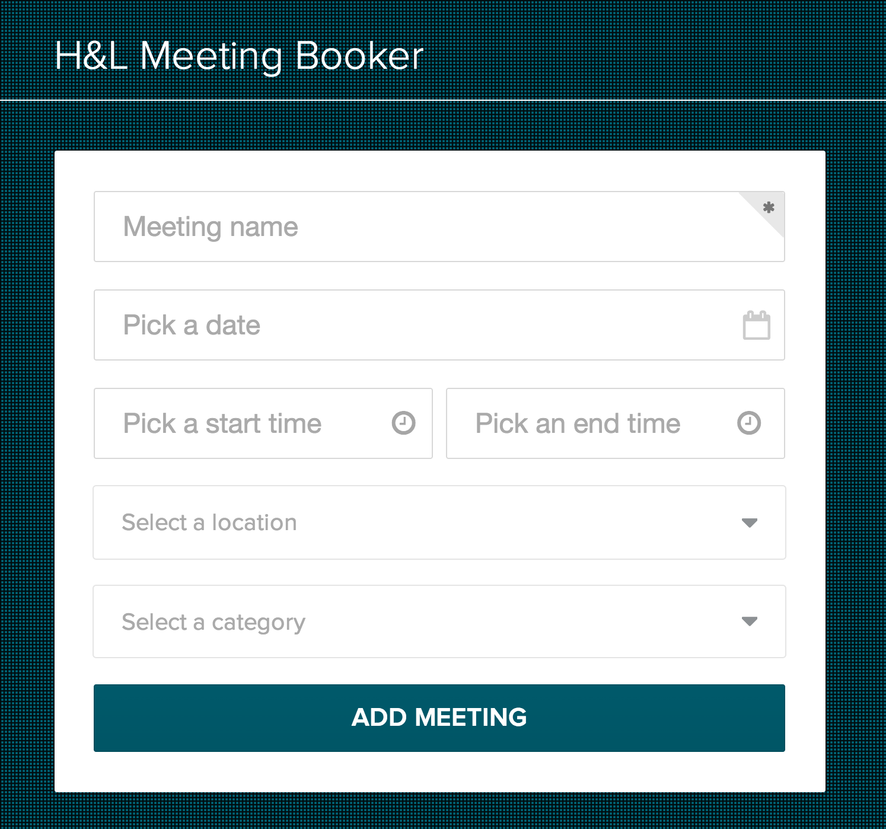

# Meeting Booker

### Live Site: [fabmeetingbooker.herokuapp.com](http://fabmeetingbooker.herokuapp.com/)

### Description
A simple meeting booker built on top of Marionette and Backbone.

### Steps to Get the App Set Up
1. Install **Node**: instructions [here](http://nodejs.org)
2. **Fork** this repo
3. **Clone** it down locally
4. In your terminal, run `npm install`
5. In your terminal, run `gulp`. If you make any changes to any JavaScript files under the `public/javascripts` folder or any Stylus files under the `public/stylesheets` folder, Gulp will recompile your changes. Refresh your browser to see them.

### Steps to Get the App Running
1. Follow the setup steps above
2. In a new terminal, run `node ./bin/www` to launch the app
3. Check out the app at [localhost:3000](http://localhost:3000)

### Steps to Run the Tests
1. Follow the setup steps above
2. Open [`test/index.html`](test/index.html) in a browser
3. Refresh the page to re-run tests

### Client-Side Tech / Libs
* [Backbone](http://backbonejs.org)
* [Marionette](http://marionettejs.com)
* [Backbone.Radio](https://github.com/marionettejs/backbone.radio)
* [Backbone localStorage Adapter](https://github.com/jeromegn/Backbone.localStorage)
* [jQuery](http://jquery.com)
* [Underscore](http://underscorejs.org)
* [Stylus](http://learnboost.github.io/stylus)

### Server-Side Tech / Libs
* [Node](http://nodejs.org)
* [Express](http://expressjs.com)
* [Jade](http://jade-lang.com)
* [Gulp](http://gulpjs.com)

### Testing Tech / Libs
* [Mocha](http://mochajs.org)
* [Expect.js](https://github.com/LearnBoost/expect.js)

### Other External Libs
* [Semantic UI](http://semantic-ui.com)
* [pickadate.js](http://amsul.ca/pickadate.js/index.htm)

### MongoDB Version
* There's a variation of this app that lets you persist to a database on the [mongodb branch](https://github.com/jdaudier/marionette-meeting-booker/tree/mongodb)
